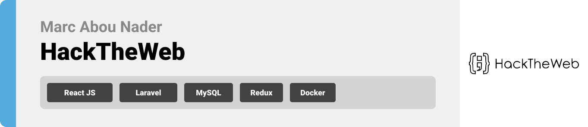
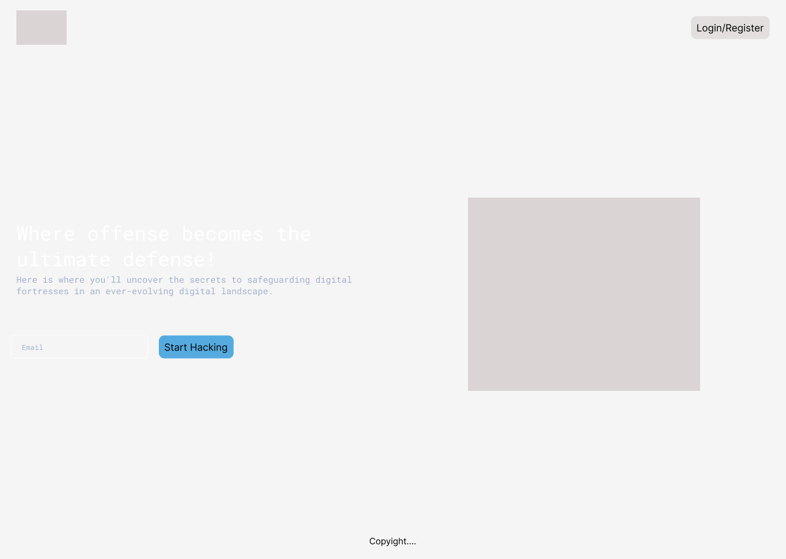
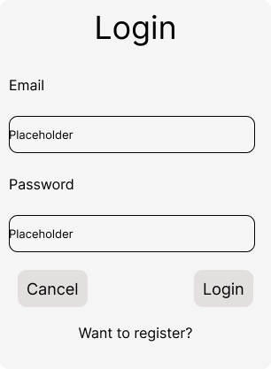
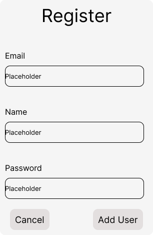
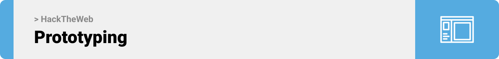
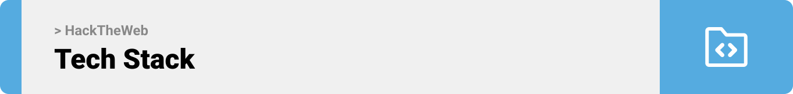

<br><br>

<!-- project philosophy -->


> The HackTheWeb platform serves as an educational tool, providing users with a comprehensive understanding of various web application attacks and their practical execution.
> HackTheWeb's aim is to empower users with the knowledge and skills required to either build robust, secure web applications or to effectively assess their security through penetration testing. Participants will advance through the program by progressively mastering web application attacks, advancing to higher levels upon successful completion. Additionally, an AI chatbot is available to assist users when they encounter challenges at any level, offering valuable information and tips to help them overcome obstacles and progress further.

### User Stories
- As a student, i want to login to the platform so that i would see the user dashboard.
- As a web app developer, i want to be able to see the ranks of the top hackers so that i would evaluate myself.
- As a penetration tester, i want to implement web app attacks on the platform so that i would know how to test it on my company’s application.
- As an SOC analyst, i want to communicate with an AI-driven chatbot so that i would be guided on how to implement the attack.
- As any user, i want to see details about the attack definition so that i would learn more about web app attacks before implementing.
- As a DevSecOps professional, i want to be able to see the vulnerable code so that i would be able to secure my projects.
- As a software developer, i want to be able to alter between levels so that i would implement more advanced attacks. 
- As an admin, i want to be able to login to the platform so that i would access to admin console.
- As an admin, i want to be able to perform CRUD operations so that i would manage users.
- As an admin, i want to be able to perform CRUD operations so that i would manage labs
- As an admin, i want to be able to perform CRUD operations so that i would manage badges.
- As a student, i want to be able to list all the labs so that i would press the one i am interested in.
- As a penetration tester, i want to be able to have a score that i would rank between other professionals.
- As a student, i want to be able to restart the lab so that i would be able to implement the attack again
- As a web app developer, i want to view the implementation so that i would be able to securely develop my apps.
- As a SOC analyst, i want to logout from the platform so that i would stop training.

<br><br>

<!-- Prototyping -->


> We designed HackTheWeb using wireframes and mockups, iterating on the design until we reached the ideal layout for easy navigation and a seamless user experience.

### Wireframes
| Landing screen | Login modal | Register modal |
| ---| ---| ---|
|  |  |  |

### Mockups
| Home screen  | Achievements Screen | Labs Screen |
| ---| ---| ---|
|  |  |  |

<br><br>

<!-- Implementation -->


> Using the wireframes and mockups as a guide, we implemented the HackTheWeb app with the following features:

### Admin Screens (Web)
| Home screen  | Badges screen |  Labs screen |
| ---| ---| ---|
|  |  |  |
| Active Labs screen  | Users Screen | Add Lab Screen |
|  |  |  |

### Watch Youtube Demos

* [Admin Dashboard](https://youtu.be/aXHIg-stIlk)
* [Hacker Dashboard](https://youtu.be/VaY9ahxzs2I)

<br><br>

<!-- Tech stack -->


###  HackTheWeb is built using the following technologies:

- This project uses the [React JS](https://legacy.reactjs.org/) library. ReactJS (aka React) is an open-source JavaScript-based user interface library. It is insanely popular in web development communities today. React Native is equally popular among mobile application developers.
- For persistent storage (database), the app uses [MySQL](https://www.mysql.com/), an open-source relational database management system (RDBMS) that is widely used for storing and managing structured data.
- This project uses the [Laravel](https://laravel.com/) PHP Framework. Laravel is a powerful and popular open-source PHP framework known for its simplicity and elegance. It simplifies web application development by providing tools and libraries for tasks like routing, authentication, and database management, enabling developers to build robust and maintainable web applications more efficiently.
- To create isolated labs, the app uses the [Docker](https://www.docker.com/) technology. Docker is a platform that enables developers to create, deploy, and run applications in containers.
- The app uses the font ["Work Sans"](https://fonts.google.com/specimen/Roboto+Mono) as its main font, and the design of the app adheres to the material design guidelines.

<br><br>

<!-- How to run -->


> To set up HackTheWeb locally, follow these steps:

### Prerequisites

* Install Node Js.
* Install PHP.
* Install Composer.
* Install Docker.
* Install XAMPP.

### FrontEnd Installation

1. Clone the repo
   ```sh
   git clone https://github.com/marcabounader/HackTheWeb-FrontEnd.git
   ```
2. Change base url of helper function according to backend url(\src\helpers):
3. Install NPM packages
   ```sh
   npm install
   ```
4. Change the following base URLs in auth.helpers.js: base_url, base_url2.
5. Run the APP:
   ```sh
   npm run
   ```
### BackEnd Installation

1. Clone the repo
   ```sh
   git clone https://github.com/marcabounader/HackTheWeb-BackEnd.git
   ```
2. Install NPM packages
   ```sh
   compose install
   ```
4. Run XAMPP and create database named "hackthebox_db"
5. Build the LAB images using docker-compose. 
6. Create .env file in root folder of project and change the following variables: DB_HOST, DB_NAME, DB_USERNAME, DB_PASSWORD, CHATGTP_API_KEY, APP_URL,APP_IP.
7. Link the storage:
   ```sh
   php artisan storage:link
   ```
8. Migrate the tables with seeding:
   ```sh
   php artisan migrate --seed
   ```
10. Seed the tables with other seeders:
   ```sh
   php artisan db:seed --class=UserSeeder
   ```
   ```sh
   php artisan db:seed --class=LabSeeder
   ```
   ```sh
   php artisan db:seed --class=BadgeSeeder
   ```
11. Generate JWT secret:
   ```sh
   php artisan jwt:secret
   ```
12. Run the APP:
   ```sh
   php artisan serve
   ```

Now, you should be able to run HackTheWeb locally and explore its features.

## My Postman Collection

[](./readme/Postman/HackTheWeb-Admin.postman_collection.json)
[](./readme/Postman/HackTheWeb-User.postman_collection.json)
